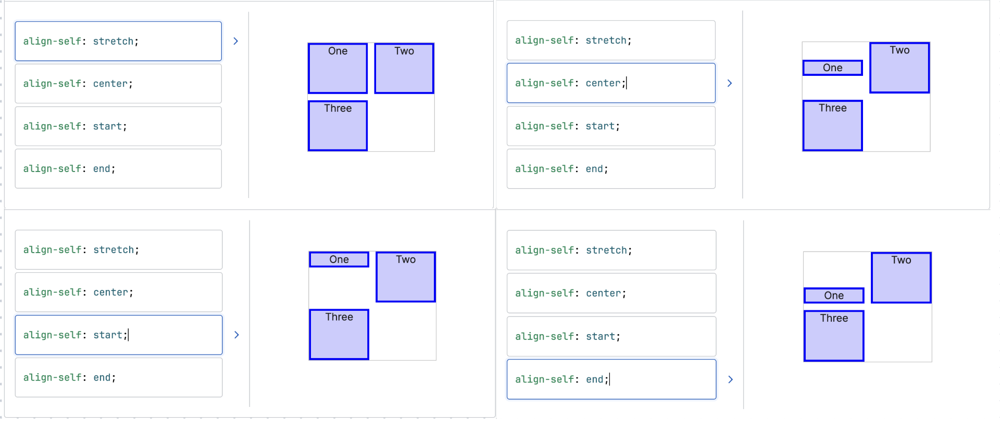

# Flexbox

## Limit the stretch and reposition
The default behaviour of a child element of a flex box container is to `vertically stretch` to fill the container.  

We can use `align-self` property to limit the stretch

We can also use `margin` property to 
- limit the stretch
- push the element to a certain position

### align-self
It allows us to take a control of an **individual** element's alignment when it is inside a flex container. 
```css
button {
    align-self: center;
    align-self: flex-bottom;
    align-self: flex-start;
}
```


### margin auto on flexbox children
```css
.meme-container {
    display: flex;
}
.meme-text {
    /* set the margin property to auto opposite to the direction you want to push */
    margin: auto 0 0 auto; /* push the text to bottom right*/
}
```

## justify-content and align-items
```css
    /* justify-content:
    start, center, end, space-around, 
    space-evenly, space-between
    
    align-items:
    start, center, end */
```
## flex-wrap
```css
.thumbnails {
    display: flex;
    /* wrap child elements with a max width instead of just laying them out horizontally. */
    flex-wrap: wrap;
    max-width: 560px;
    margin: 50px auto;
}

.flex-item {
    /* min width of each flex item */
    flex-basis: 200px;
    /* it will take up all the remaining space in the row */
    flex-grow: 1;
}
/* equal to */
.flex-item {
    flex: 1 200px;
}
```

## reorder the flex items
### flex-direction
```css
.container{
    display: flex;
    flex-direction: row-reverse;
}
```

### order
With order property, we can change the visual orders of the flex items. The default order value is 0.   

- -1: display item first  
- 1: display item last
```css
.coat {
    order: 1;
}

.dish {
    order: 2;
}

.tube {
    order: 3;
}


```
We want the screen readers to read the h1 and p first, but in visual, we want to show the top text first. 
```html
<section class="intro">
    <h1>Turn <strong>your picture</strong> into an iconic <strong>Scrimba avatar</strong></h1>
    <span class="beta-text">Currently in Beta</span>
    <p class="top-text">Powered by Scrimba</p>
</section>
```
```css
.intro { 
    display: flex;
    flex-direction: column; 
    justify-content: space-between;
}

.top-text {
    order: -1;
}
```


