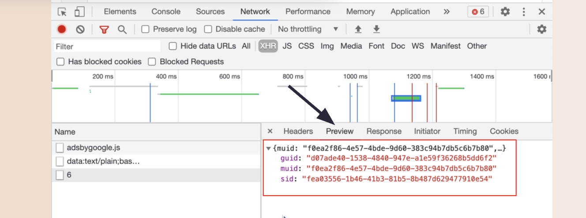

# API
* Application Programming Interface
* An API is a tool that can connect your program with someone else's program 
* The server holds the API (exposed endpoint), and we can access for getting data. 

## Client and server
* Client: Any device that makes a `request` of to get data **(resources)** from somewhere
* Server: A computer. It accepts requests from clients, and `response` to that request

## Server response code
200: ok   
300: forbidden    
500: Internal Server Error 

## JSON
Javascript object notation  
* Valid JSON: https://jsonlint.com/
* The key needs to be surrounded by `double quotes`
* In most cases, it would be 1 object or an array of objects
```json
// person.json
{
    "name": "Joe Schmoe",
    "age": 42,
    "adult": true,
    "hobbies": [
        "skiing",
        "surfing",
        "piccolo"
    ]
}
```
```json
[
    {
        "name": "Sarah",
        "age": 35,
        "birthplace": "Scotland",
        "hobbies": [
            "violin",
            "singing",
            "crafting"
        ]
    },
    {
        "name": "Michael",
        "age": 56,
        "birthplace": "South Africa",
        "hobbies": [
            "skateboarding",
            "guitar"
        ]
    }
]
```
Check JSON in dev tool


## .then() and Asynchronous Javascript
It lets the `other codes run first` before the response from the fetch request come back from the server
```js
console.log("The first console log")

fetch("https://dog.ceo/api/breeds/image/random")
    .then(response => response.json())
    .then(data => console.log(data))

console.log("The second console log")

>>> 
The first console log
The second console log
{message: 'https://images.dog.ceo/breeds/affenpinscher/n02110627_12003.jpg', status: 'success'}
```

## `async` & `await`  
await does not change how Promises work — it only makes the code look synchronous.  
```js
async function loadData() {
  try {
    const data = await fetch("/data");
    // fulfilled
  } catch (error) {
    // rejected
  } finally {
    // always runs
  }
}
```

## Basic fetch with JSON
```js
fetch("https://dog.ceo/api/breeds/image/random")
    // parse the response into JSON
    .then(response => response.json())
    .then(data => console.log(data))
```