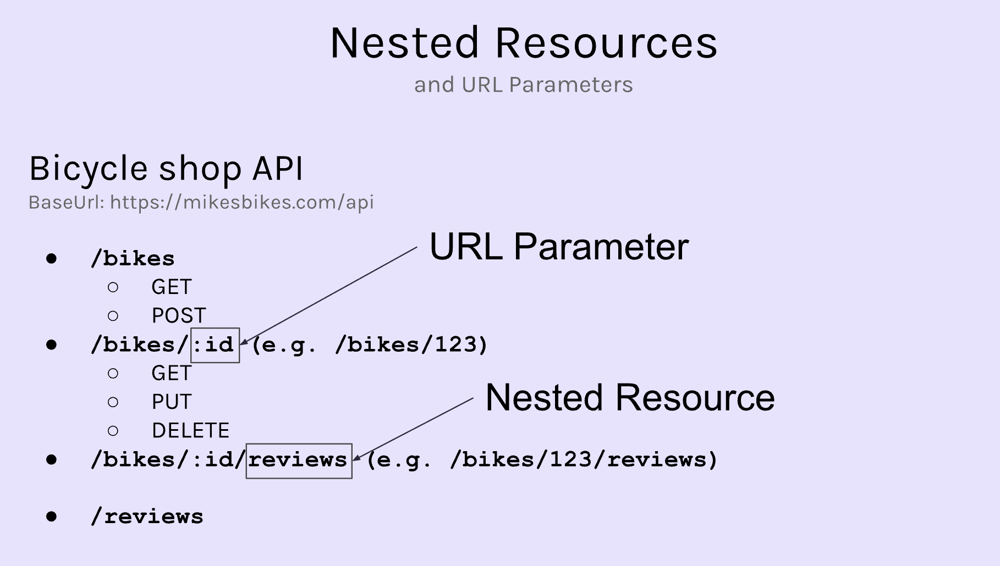

# API
* Application Programming Interface
* An API is a tool that can connect your program with someone else's program 
* The server holds the API (exposed endpoint), and we can access for getting data. 

## Client and server
* Client: Any device that makes a `request` of to get data **(resource)** from somewhere
    * HTML page
    * JSON 
    * Image file
* Server: A computer. It accepts requests from clients, and `response` to that request

## Server response code
200: ok   
300: forbidden    
500: Internal Server Error 

## JSON
Javascript object notation  
* Valid JSON: https://jsonlint.com/
* The key needs to be surrounded by `double quotes`
* In most cases, it would be 1 object or an array of objects
```json
// person.json
{
    "name": "Joe Schmoe",
    "age": 42,
    "adult": true,
    "hobbies": [
        "skiing",
        "surfing",
        "piccolo"
    ]
}
```
```json
[
    {
        "name": "Sarah",
        "age": 35,
        "birthplace": "Scotland",
        "hobbies": [
            "violin",
            "singing",
            "crafting"
        ]
    },
    {
        "name": "Michael",
        "age": 56,
        "birthplace": "South Africa",
        "hobbies": [
            "skateboarding",
            "guitar"
        ]
    }
]
```
* Check JSON in dev tool
* Network → Fetch/XHR = check the requested API


## HTTP request component
HTTP is a protocol(an agreed and standard way of doing something) for determinging how the hypertext should be transferred over the internet

* **Path(URL)**: It is the URL that the client is sending the request to. / The server is living in the URL address. 
    * Base URL: This will not change no matter what kind of resources you are getting from the API - `https://apis.scrimba.com/jsonplaceholder`
    * Endpoint: Specific resource that you want to get. We should only use `noun`, for exmaple **/posts**
    * Full URL: https://apis.scrimba.com/jsonplaceholder/posts. Once we click the link, the `browser` will send a `GET request` to the URL. 

* **Method**: tell the server what is your intention with the request / what kind of request it is
    * GET 
    * POST - Add new data to the server
    * PUT - Update existing data
    * DELETE
* **Body**: The data we want to send back to server. Only for POST and PUT. 
* **Headers**: meta data about the request like what kind of browser is sending the request 
    * authentication tokens
    * body information
    * client information

## Fetch
### GET
```js
// default is GET request
fetch("https://dog.ceo/api/breeds/image/random")
    // parse the response from JSON into Javascript
    .then(response => response.json())
    .then(data => console.log(data))
```
Specify the method of the request
```js
fetch("https://apis.scrimba.com/jsonplaceholder/todos", {method: "GET"})
```
### POST
```js
const options = {
    method: "POST",

    // tell the server that we are sending data in a json format
    headers: {
        "Content-Type": "application/json"
    }

    // use JSON.stringify to change js object to JSON
    body: JSON.stringify({
        title: "Buy Milk",
        completed: false
    })
}

fetch("https://apis.scrimba.com/jsonplaceholder/todos", options)
    .then(res => res.json())
    .then(data => console.log(data))

// it means the id of the new data is 201
>>> {title: 'Buy Milk', completed: false, id: 201}
```

## REST
Representational State Transfer  
* REST is a design pattern to provide a standard way for clients and servers to communicate with each other. 
### Princile of REST
1. Client & Server seperation
* For a RESTful API, The server isn't responsible to figure out how to display the data; It just send data (JSON in most cases) to the client and let the client itself to render the data. 
    * Client: Request JSON data. 
    * Server: Send JSON data to client.
* If we are not adhering to the REST
    * Client: Navigate to a website in a browser.
    * Server: `Build HTML page with data` and send them back. It's server side rendering. 
    
2. Statelessness: It forgets the interaction after the response is sent.

3. Accessing resources: There's a standard way of setting the endpoints.

### Resourses
* /bike
* `URL parameter`: 
    * /bike/:id
* `Nested resources`: 
    * /bike/1/reviews
    * /posts/1/comments
    * /albums/1/photos
    * /users/1/albums
    * /users/1/todos
    * /users/1/posts
* `Query string`: /bikes/?type=mountain&brand=nike




